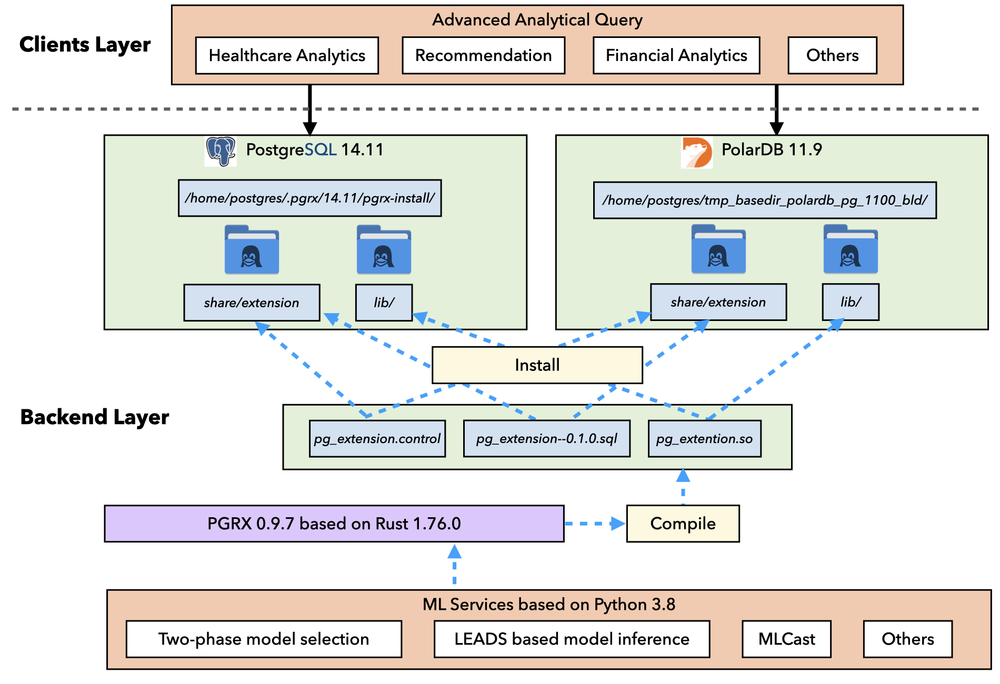

# TRAILS: A Database Native Model Selection System




# Build & Run examples

## PyTorch + PostgreSQL

```bash
# Remove existing one if there is 
docker rm -f trails
# Create project folder.
mkdir project && cd project
# Download the Dockerile.
wget -O Dockerfile https://raw.githubusercontent.com/NLGithubWP/Trails/main/torch.psql.Dockerfile

# Build Dockerile and run the docker.
docker build -t trails .
docker run -d --name trails --network="host" trails
# Monitor the logs until the setup step is done.
docker logs -f trails

# Connect to the pg server and use pg_extension database.
docker exec -it trails bash
psql -h localhost -p 28814 -U postgres
\c pg_extension

# Test coordinator
SELECT coordinator('0.08244', '168.830156', '800', false, '/project/Trails/internal/ml/model_selection/config.ini');
# Run an example, wait one min, it will run filtering + refinemnt + training the selected model.
CALL model_selection_end2end('frappe_train', ARRAY['col1', 'col2', 'col3', 'col4','col5','col6','col7','col8','col9','col10', 'label'], '10', '/project/Trails/internal/ml/model_selection/config.ini');

# In other terminal, monitor the running process
docker exec -it trails_polardb bash
tail -f /home/postgres/.pgrx/data-14/trails_log_folder/<log_file_name>
```
## PyTorch + PolarDB

```bash
# Remove existing one if there is 
docker rm -f trails_polardb
# Create project folder.
mkdir project_polardb && cd project_polardb
# Download the Dockerile.
wget -O Dockerfile https://raw.githubusercontent.com/NLGithubWP/Trails/main/torch.polarDB.Dockerfile

# Build Dockerile and run the docker.
docker build -t trails_polardb .
docker run -d --name trails_polardb  trails_polardb
# Monitor the logs until the setup step is done.
docker logs -f trails_polardb
# Run a setup script
docker exec trails_polardb /bin/bash -c "/home/postgres/Trails/init_polardb.sh"

# Connect to the primary pg server and use pg_extension database.
docker exec -it trails_polardb bash
psql -h localhost -p 5432 -U postgres 
\c pg_extension

# Test coordinator
SELECT coordinator('0.08244', '168.830156', '800', false, '/home/postgres/Trails/internal/ml/model_selection/config.ini');
# Run an example, wait one min, it will run filtering + refinemnt + training the selected model.
CALL model_selection_end2end('frappe_train', ARRAY['col1', 'col2', 'col3', 'col4','col5','col6','col7','col8','col9','col10', 'label'], '10', '/home/postgres/Trails/internal/ml/model_selection/config.ini');

# In other terminal, monitor the running process
docker exec -it trails_polardb bash
tail -f /var/polardb/primary_datadir/trails_log_folder/<log_file_name>
```

## Singa + PolarDB/PostgreSQL
Document is at [here](https://github.com/apache/singa/tree/dev-postgresql/examples/model_selection/Trails)


# Reproduce the result

Document is at [here](https://github.com/NLGithubWP/Trails/blob/main/internal/ml/model_selection/documents/README.md)

